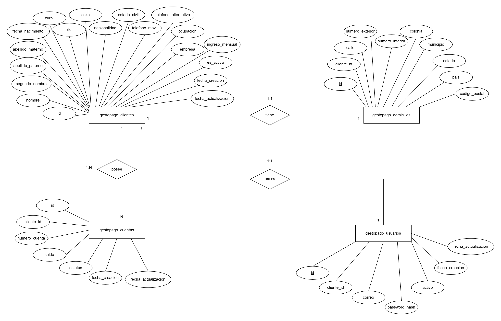

# Onboarding de clientes personas físicas

Este módulo resuelve el registro de clientes personas físicas. Recibe sus datos personales, de contacto, domicilio e información laboral y, cuando el registro es válido, crea automáticamente su cuenta bancaria y su usuario de acceso. También permite consultar la información, corregir los datos editables y realizar bajas lógicas sin perder el historial almacenado.

## Cómo se implementó

La aplicación está desarrollada en Java 17 con Spring Boot y Gradle. Los controladores exponen la API REST; los servicios concentran las validaciones y reglas de negocio; los repositorios JPA/Hibernate se encargan de las consultas y la persistencia en PostgreSQL. Las solicitudes y respuestas usan modelos separados de las entidades para controlar qué datos entran y cuáles se muestran. Las tablas se crean mediante las migraciones de Flyway ubicadas en `src/main/resources/db/migration`.

El registro se ejecuta en una sola transacción: primero se comprueban los datos y los duplicados, y después se guardan el cliente, el domicilio, la cuenta y el usuario. Si ocurre un error, se revierte la operación para no dejar un cliente registrado a medias. La cuenta nace **ACTIVA**, con saldo inicial de **$0.00** definido por el sistema. Su número se genera con una secuencia de la base de datos y se completa a 20 caracteres con ceros a la izquierda; además, una restricción `UNIQUE` impide repetirlo.

## Datos y relaciones

La información se divide en cuatro tablas: `gestopago_clientes` guarda los datos personales y laborales; `gestopago_domicilios`, la dirección; `gestopago_cuentas`, el número, saldo y estatus de cada cuenta; y `gestopago_usuarios`, el correo y los datos necesarios para el acceso. Cada tabla tiene su llave primaria. Las llaves foráneas relacionan al cliente con **un domicilio, un usuario y varias cuentas**; las restricciones de unicidad en `cliente_id` aseguran las dos relaciones uno a uno.

La base de datos también protege los datos importantes: CURP y RFC son únicos, el correo del usuario es único sin distinguir mayúsculas de minúsculas, el ingreso debe ser mayor que cero y el saldo no puede ser negativo. Se usan `BigDecimal` en Java y `NUMERIC(15,2)` en PostgreSQL para manejar importes sin los errores de precisión de `double`. Las fechas se manejan como `LocalDate`/`DATE`, los estados activos como valores booleanos y los identificadores como enteros. CURP, RFC, teléfonos, código postal y número de cuenta se almacenan como texto porque son identificadores, no cantidades que deban calcularse, y así se conservan sus ceros iniciales.

## Diagrama entidad–relación



## Reglas y operaciones

Antes de guardar un cliente se valida que tenga al menos 18 años y que los campos obligatorios respeten sus formatos y longitudes. Esto incluye nombres con letras y espacios, CURP de 18 caracteres, RFC de 13 caracteres para persona física, correo válido, teléfonos de 10 dígitos, código postal de 5 dígitos e ingreso mensual mayor que cero. El segundo nombre, el teléfono alternativo y el número interior son opcionales. También se rechazan CURP, RFC y correos ya registrados.

La API permite buscar clientes por ID, CURP, RFC, correo o número de cuenta, consultar el saldo de una cuenta y listar clientes o cuentas activos. También ofrece un filtro de clientes por rango de fechas de creación. Los listados están paginados y muestran solo un resumen para que la respuesta no sea innecesariamente grande; la consulta individual entrega el detalle del cliente, su domicilio y sus cuentas.

Los datos editables pueden cambiarse por completo con `PUT /clientes/{id}` o de forma parcial con `PATCH /clientes/{id}`. CURP, RFC y número de cuenta no forman parte de esas actualizaciones. Si cambia el correo, también se actualiza el del usuario, que es el que utiliza para iniciar sesión. Al dar de baja a un cliente, el sistema marca como inactivos al cliente, su usuario y sus cuentas; no elimina las filas. Una cuenta puede cancelarse por separado si pertenece al usuario autenticado y tiene saldo cero. En ese caso se inactiva la cuenta, pero el cliente y su usuario conservan el acceso.

## Acceso y manejo de errores

Durante el registro se solicita una contraseña de al menos ocho caracteres, con mayúscula, minúscula, número y carácter especial. Se guarda únicamente su hash BCrypt. El inicio de sesión verifica el correo, la contraseña y que tanto el usuario como su cliente sigan activos; si todo es correcto, devuelve un JWT con su fecha de expiración. El registro y el login son públicos, mientras que el resto de los servicios requiere un token válido. Cada usuario solo puede consultar su propio perfil o cambiar su propia contraseña; para cambiarla debe indicar la actual y elegir una diferente. La cancelación de una cuenta también comprueba que le pertenezca.

Los errores se responden con un mensaje claro y un estado HTTP acorde al caso: por ejemplo, `400` para datos inválidos, `401` para falta de autenticación o credenciales incorrectas, `403` para acceso denegado o usuario inactivo, `404` cuando no se encuentra un registro y `409` para duplicados o conflictos de negocio. Las excepciones se manejan de forma centralizada para mantener respuestas consistentes y no exponer datos sensibles.

## Ejecución, documentación y pruebas

Para ejecutar la aplicación se necesitan Java 17 y una base PostgreSQL. Deben configurarse `spring.datasource.url`, `spring.datasource.username` y `spring.datasource.password`, además de `gestopago.jwt.secret` con al menos 32 bytes; las credenciales y el secreto no se incluyen en el código. Al iniciar la aplicación, Flyway aplica las migraciones pendientes. Con la configuración disponible, se puede iniciar con `.\gradlew.bat bootRun`.

Swagger UI (`/swagger-ui.html`) muestra los endpoints y sus modelos de solicitud y respuesta. La solución se revisó con pruebas automatizadas de validación, servicios, controladores y seguridad, además de las pruebas funcionales registradas en Postman. Las automatizadas se ejecutan con `.\gradlew.bat test`; las evidencias de Postman se entregan por separado para no duplicarlas aquí.

# Sincronización de productos GestoPago

## Objetivo

Se implementó la consulta diaria de productos de GestoPago. La aplicación obtiene un token válido, consume la lista de productos, interpreta la respuesta XML y guarda la información en la base de datos para mantenerla actualizada.

## Solución implementada

- La autenticación se realiza con las credenciales configuradas en la aplicación. El token generado se guarda en `gestopago_tokens` y se reutiliza mientras esté activo; no existe un token fijo en el código fuente.
- La lista se consulta mediante `GET /sistema/service/getProductList.do` enviando el header `Authorization: Bearer <token>`.
- La respuesta XML se convierte a DTOs con JAXB. Los productos se insertan o actualizan por `idProducto` en la tabla `gestopago_productos`.
- También existe un endpoint manual, `POST /gestopago/productos/sincronizar`, y un job programado para ejecutarse diariamente a las 12:00, hora de Ciudad de México.

## Configuración

Las propiedades `gestopago.*` definen la URL base, endpoints, credenciales, horario del job y timeouts de Feign. No se documentan valores reales de credenciales; para un ambiente productivo deben proporcionarse mediante variables de entorno o un gestor de secretos.

## Manejo de errores y concurrencia

Los errores de comunicación, timeout, autenticación y respuestas no exitosas se traducen a excepciones controladas. Si GestoPago responde `401` o `403`, se renueva el token y se reintenta la consulta una sola vez. Los logs registran el inicio, resultado y tipo de error sin imprimir tokens, contraseñas ni solicitudes completas.

Para evitar consultas duplicadas ante solicitudes simultáneas, solo se permite una sincronización a la vez. Las solicitudes adicionales reciben HTTP `429` con un mensaje controlado.

## Decisiones técnicas

Se utilizó OpenFeign para la integración HTTP, JAXB para el XML, MapStruct para el mapeo y JPA/Flyway para la persistencia y migraciones. El token se persiste en base de datos para no autenticar en cada consulta, y la lógica de errores de Feign se centralizó para evitar duplicación.

## Pruebas

Las pruebas unitarias de `GestoPagoProductServiceImpl` cubren la sincronización exitosa, respuesta XML no exitosa, renovación y reintento de token, y timeout de comunicación.

Para ejecutarlas:

```powershell
.\gradlew.bat test
```
